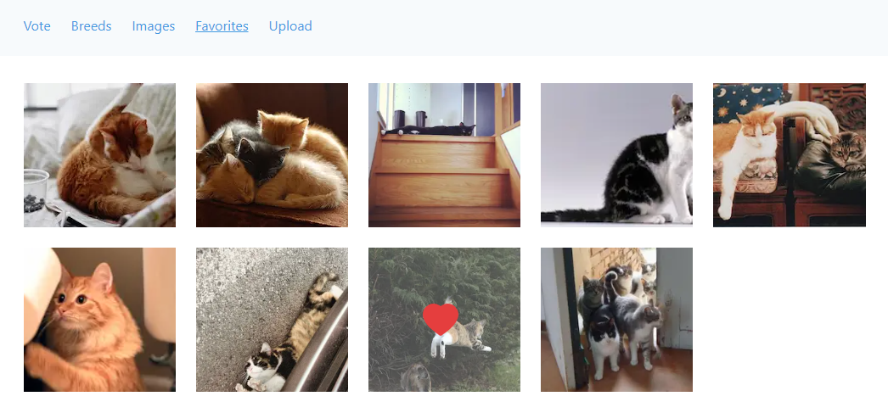

## Cats App

Cats app is a desktop web application containing information about cats. You can view cat
images, add images to favorites, vote for your favorite image, and upload your own cat images.

This is a [Next.js](https://nextjs.org/) project written in [Typescript](https://www.typescriptlang.org/).
The user interface was created using the [Chakra UI](https://chakra-ui.com/) library. A public service
API [The Cat API](https://thecatapi.com/) is used in this project.

The application uses such NextJS features like static generation and server-side rendering for better performance.
[SWR](https://swr.vercel.app/) is used for client-side data fetching.

### Let's consider some features of the application.

Since the main element of the application interface is an image, almost every image is equipped with a wrapper component
that allows you to conveniently interact with the image. Thus, you can add/remove images to your favorites by simply
clicking on the image you like. Such functionality is available on the Vote, Favorites, Image pages. At the same time,
the wrapper component will allow you to conveniently remove your uploaded images from the Upload page.

The application does not have a login and registration mechanism, therefore, a string key stored in the local storage is
used to identify the user. The key is generated automatically when the application is first opened, stored in local
storage, and uniquely identifies the current user. Thus, the user gets the opportunity to add images to favorites and
upload their own images.

The **Vote** page allows you to rate a random cat photo by voting for or against the image.

The **Breeds** page allows you to select a breed from the list and get available
information about it, such as a cat weight, country of origin of the breed, cat temperament.
Breed photos are displayed in a carousel created with [react-slick](https://www.npmjs.com/package/react-slick)

The **Images** page presents a grid of cat images and a filter to change the display results. You can choose a photo of
a given breed, or funny photos from a given category, such as cats in boxes or cats in clothes. The page is built as an
infinite loading page. 20 images are displayed to start with, and you can upload more images using the "Load more"
button.

The **Favorites** page displays a list of images added to favorites. When adding/removing
images from favorites, the cached data about favorite images is manually updated, and current favorite images are not
revalidated. This improves the user experience of interacting with the page: when an image is removed from favorites,
the preloader does not flash, since there is no request for data.

You can upload your own cat photos on the **Upload** page using the dedicated drag and drop field.
[rc-upload](https://www.npmjs.com/package/rc-upload) helped create the image upload interface and functionality.

For convenient viewing of images, pagination is used, the pagination component is created based
on [react-paginate](https://www.npmjs.com/package/react-paginate).
The logic of interaction with the cache when loading/deleting an image is similar to the logic of interaction with
favorite images.
When loading an image, only the data of those pages that are not currently displayed are revalidated. For the currently
displayed page, the cache is updated manually. When deleting an image, pages whose serial number is greater than or equal
to the current one are revalidated, but the manual cache change occurs only for the current page. This
allows to update image list of the current page without flashing the preloader and improves the user experience on the page.

